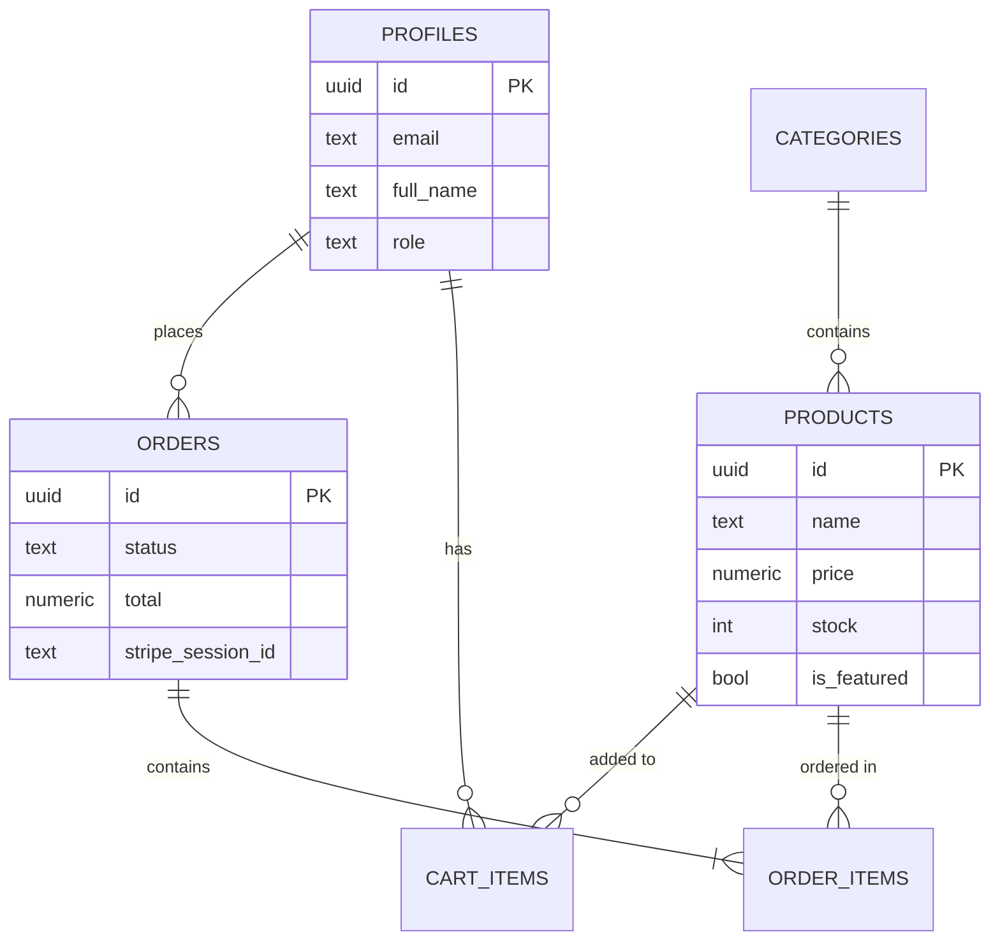

<div align="center">

# 🛒 NOVA

### ⚡ A Premium Full‑Stack E‑Commerce Platform

[](https://nextjs.org/)
[](https://www.typescriptlang.org/)
[](https://supabase.com/)
[](https://stripe.com/)
[](https://tailwindcss.com/)

<br />

**Sleek. Scalable. Stunning.**

A modern, production-ready e-commerce experience built with cutting-edge web technologies.
Designed with a premium, minimalist aesthetic inspired by Apple and Nothing.

<br />

[🚀 Live Demo](#) · [🐛 Report Bug](https://github.com/issues) · [✨ Request Feature](https://github.com/issues)

---

</div>

<br />

## 🔥 Why Nova?

> *"Not just another e-commerce template — it's a full-stack masterpiece."*

Most e-commerce projects give you the bare minimum. **Nova** gives you everything:

- 🎨 **Premium UI** — Glassmorphism, micro-animations, dark aesthetic
- 🔐 **Bulletproof Auth** — Email/Password + Google OAuth with session management
- 🛡️ **Row-Level Security** — Every database query is permission-checked
- 💳 **Stripe Checkout** — PCI-compliant hosted payments, zero card data touches your server
- 📦 **Webhook-Driven Orders** — Orders only exist after confirmed payment
- 🛒 **Smart Cart** — Guest cart (localStorage) auto-syncs to DB on login
- 👑 **Admin Panel** — Full CRUD, image uploads, order management

<br />

## 🏗️ Architecture

```
┌─────────────────────────────────────────────────────┐
│                    NEXT.JS APP ROUTER                │
│  ┌──────────┐  ┌──────────┐  ┌────────────────────┐ │
│  │  Server   │  │  Client  │  │    API Routes      │ │
│  │Components │  │Components│  │  /api/checkout      │ │
│  │  (SSR)    │  │  (CSR)   │  │  /api/webhooks     │ │
│  └─────┬─────┘  └────┬─────┘  └─────────┬──────────┘ │
│        │              │                  │            │
│  ┌─────▼──────────────▼──────────────────▼──────────┐ │
│  │              SUPABASE CLIENT                      │ │
│  │    Server Client │ Browser Client │ Admin Client  │ │
│  └──────────────────┬───────────────────────────────┘ │
└─────────────────────┼───────────────────────────────┘
                      │
          ┌───────────▼───────────┐
          │   SUPABASE CLOUD      │
          │  ┌─────────────────┐  │
          │  │   PostgreSQL    │  │    ┌──────────────┐
          │  │   + RLS         │  │◄───│    STRIPE     │
          │  ├─────────────────┤  │    │   Webhooks    │
          │  │   Auth (GoTrue) │  │    │   Checkout    │
          │  ├─────────────────┤  │    └──────────────┘
          │  │   Storage       │  │
          │  └─────────────────┘  │
          └───────────────────────┘
```

<br />

## ✨ Features at a Glance

<table>
<tr>
<td width="50%">

### 🏠 Storefront
- Hero section with gradient & animated orbs
- Featured products grid
- Category browsing
- Search with debounced input
- Sort & filter (price, category, newest)
- Pagination
- Product detail with image gallery
- Related products

</td>
<td width="50%">

### 🔐 Authentication
- Email/Password sign up & login
- Google OAuth integration
- Protected routes via middleware
- Session refresh & persistence
- Auto-redirect flows
- User profile page

</td>
</tr>
<tr>
<td width="50%">

### 🛒 Cart & Checkout
- Guest cart with localStorage
- Authenticated cart with Supabase
- Auto-sync on login
- Quantity controls & item removal
- Stripe hosted checkout
- Webhook-driven order creation
- Order confirmation page

</td>
<td width="50%">

### 👑 Admin Panel
- Role-based access (admin only)
- Dashboard with stats & recent orders
- Product CRUD (create, edit, delete)
- Image upload to Supabase Storage
- Category management
- Order list with status badges

</td>
</tr>
</table>

<br />

## 🛠️ Tech Stack

| Layer | Technology |
|-------|-----------|
| **Framework** | Next.js 16 (App Router, Server Components) |
| **Language** | TypeScript 5 |
| **Styling** | Tailwind CSS v4 (`@theme` directive) |
| **Database** | Supabase PostgreSQL + Row-Level Security |
| **Auth** | Supabase Auth (Email + Google OAuth) |
| **Payments** | Stripe Checkout (hosted) + Webhooks |
| **Storage** | Supabase Storage (product images) |
| **Icons** | Lucide React |
| **Toasts** | Sonner |
| **Deployment** | Vercel-ready |

<br />

## 📁 Project Structure

```
d:\Ecommerce/
├── src/
│   ├── app/                    # Next.js App Router
│   │   ├── (auth)/             # Login & Signup pages
│   │   ├── admin/              # Admin panel (protected)
│   │   │   ├── products/       # Product CRUD
│   │   │   └── orders/         # Order management
│   │   ├── api/                # API routes
│   │   │   ├── auth/callback/  # OAuth callback
│   │   │   ├── checkout/       # Stripe session creation
│   │   │   └── webhooks/       # Stripe webhook handler
│   │   ├── cart/               # Cart page
│   │   ├── categories/         # Category browsing
│   │   ├── checkout/           # Checkout + success page
│   │   ├── products/           # Product listing & detail
│   │   └── profile/            # User profile + orders
│   ├── components/
│   │   ├── admin/              # Admin-specific components
│   │   ├── layout/             # Header, Footer
│   │   ├── products/           # Product card, grid, detail
│   │   └── ui/                 # Button, Input, Badge, Modal, Skeleton
│   ├── lib/
│   │   ├── supabase/           # Client, Server, Admin clients
│   │   ├── stripe.ts           # Stripe instance
│   │   └── utils.ts            # Helpers (cn, formatPrice, slugify)
│   ├── providers/              # Auth & Cart context providers
│   ├── services/               # Data fetching (products, categories, orders)
│   └── types/                  # TypeScript types (database, product, cart, order)
├── supabase/
│   ├── schema.sql              # Full database schema + RLS
│   └── seed.sql                # Sample data (5 categories, 12 products)
├── .env.local                  # Environment variables
├── next.config.ts              # Image remote patterns
├── tailwind.config.ts          # Tailwind configuration
└── package.json
```

<br />

## 🚀 Quick Start

### Prerequisites
- **Node.js** 18+
- **Supabase** account ([supabase.com](https://supabase.com))
- **Stripe** account ([stripe.com](https://stripe.com))

### 1️⃣ Clone & Install

```bash
git clone https://github.com/your-username/Nova-E-Commerce-Website.git
cd Nova-E-Commerce-Website
npm install
```

### 2️⃣ Set Up Supabase

1. Create a new project at [supabase.com](https://supabase.com)
2. Go to **SQL Editor** → paste and run `supabase/schema.sql`
3. Then paste and run `supabase/seed.sql`
4. Go to **Settings → API** → copy your keys

### 3️⃣ Set Up Stripe

1. Go to [dashboard.stripe.com](https://dashboard.stripe.com) (Test Mode)
2. Copy your **Publishable** and **Secret** keys from **Developers → API Keys**

### 4️⃣ Configure Environment

```bash
cp .env.local.example .env.local
```

Fill in your keys:
```env
NEXT_PUBLIC_SUPABASE_URL=https://your-project.supabase.co
NEXT_PUBLIC_SUPABASE_ANON_KEY=your-anon-key
SUPABASE_SERVICE_ROLE_KEY=your-service-role-key
NEXT_PUBLIC_STRIPE_PUBLISHABLE_KEY=pk_test_...
STRIPE_SECRET_KEY=sk_test_...
STRIPE_WEBHOOK_SECRET=whsec_...
NEXT_PUBLIC_APP_URL=http://localhost:3000
```

### 5️⃣ Launch 🚀

```bash
npm run dev
```

Open [http://localhost:3000](http://localhost:3000) and enjoy!

<br />

## 🗄️ Database Schema



<br />

## 🔒 Security

| Feature | Implementation |
|---------|---------------|
| **Row-Level Security** | All tables have RLS policies — users can only access their own data |
| **Admin Protection** | Middleware checks `role: admin` before granting access |
| **Payment Security** | Stripe hosted checkout — no card data touches our server |
| **Webhook Verification** | Stripe signature verification on all webhook events |
| **Auth Middleware** | Routes like `/checkout`, `/profile`, `/admin` are protected |
| **Service Role Isolation** | Admin client only used server-side, never exposed to browser |

<br />

## 🌐 Deployment

This project is **Vercel-ready** out of the box:

```bash
npm run build   # Build for production
vercel deploy   # Deploy to Vercel
```

Add all environment variables in Vercel's project settings.

<br />

## 📝 Admin Access

To access the admin panel at `/admin`:

1. Sign up for an account
2. Go to Supabase → **Table Editor** → `profiles` table
3. Find your user → change `role` from `user` to `admin`
4. Refresh the page → you'll see the **Admin** link in the header

<br />

---

<div align="center">

## 👨‍💻 Built By

### **Pranav Vashisth**

[](https://www.linkedin.com/in/pranav-vashisth/)
[](mailto:pvashitsh07@gmail.com)

<br />

---

<br />

⭐ **Star this repo** if you found it useful!

Made with ❤️ and way too much ☕

<br />

<sub>© 2026 Nova. All rights reserved.</sub>

</div>
